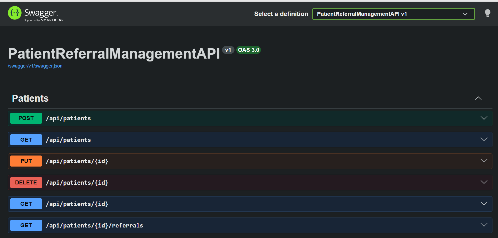
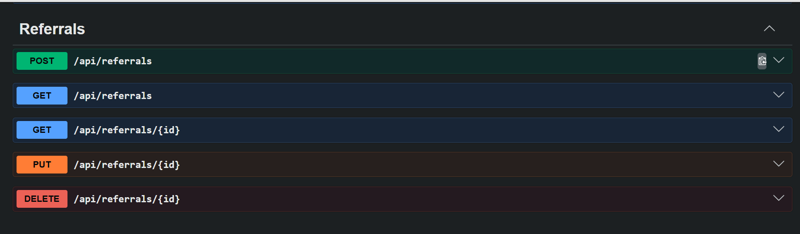

# 🏥 Patient Referral Management API

A RESTful API built with **.NET 8** for managing patients and referrals.
This project follows a **clean layered architecture** with validation, exception handling, and unit testing.

---

## 🚀 Tech Stack

* .NET 8 Web API
* Entity Framework Core
* SQL Server
* Swagger (OpenAPI)

---

# 🚀 Features

* ✅ Patient CRUD
* ✅ Referral CRUD
* ✅ Pagination support
* ✅ Global Exception Handling
* ✅ FluentValidation integration
* ✅ AutoMapper mapping
* ✅ Unit Testing (Controller & Service)
* ✅ Structured Logging (Serilog)

---

# 🧱 Architecture

```
Controller → Service → Repository → Database
```

### Explanation:

* **Controller** → Handle HTTP request/response
* **Service** → Business logic
* **Repository** → Database access (EF Core)

---

# 📁 Project Structure

```
PatientReferralManagementAPI/
│
├── Controllers/                # API endpoints (Patients, Referrals)
│   ├── PatientsController.cs
│   ├── ReferralsController.cs
│
├── Services/                  # Business logic layer
│   ├── PatientService.cs
│   ├── ReferralService.cs
│
├── Repositories/              # Data access layer
│   ├── IPatientRepository.cs
│   ├── IReferralRepository.cs
│   ├── PatientRepository.cs
│   ├── ReferralRepository.cs
│
├── DTO/                       # Data Transfer Objects
│   ├── Common/
│   │   ├── ApiResponse.cs
│   │   ├── PagedResponse.cs
│   │
│   ├── Patient/
│   │   ├── CreateUpdatePatientDto.cs
│   │   ├── PatientResponseDto.cs
│   │
│   ├── Referral/
│       ├── CreateReferralDto.cs
│       ├── UpdateReferralDto.cs
│       ├── ReferralResponseDto.cs
│
├── Models/                    # Entity models (Database)
│   ├── Patient.cs
│   ├── Referral.cs
│
├── Data/                      # Database context & SQL scripts
│   ├── AppDbContext.cs
│   ├── InitDb.sql
│   ├── PatientReferralManagementAPI.postman_collection.json
│
├── Validators/                # Validation & Middleware
│   ├── CreatePatientValidator.cs
│   ├── CreateReferralValidator.cs
│   ├── UpdateReferralValidator.cs
│   ├── ExceptionMiddleware.cs
│   ├── Exceptions.cs
│   ├── ServiceExtensions.cs
│
├── Mapping/                   # AutoMapper configuration
│   ├── MappingProfile.cs
│
├── Helpers/                   # Utility classes
│   ├── SnakeCaseNamingPolicy.cs
│
├── logs/                      # Application logs
│   ├── log-*.txt
│
├── appsettings.json           # Configuration
├── Program.cs                 # Entry point
└── PatientReferralManagementAPI.http

PatientReferralManagement.Test/
│
├── Controllers/
│   ├── PatientsControllerTests.cs
│   ├── ReferralsControllerTests.cs
│
├── Services/
│   ├── PatientServiceTests.cs
│   ├── ReferralServiceTests.cs
```

---

# ⚙️ Setup Instructions

## 1. Clone Project

```bash
git clone https://github.com/herlenadita/PatientReferralManagementAPI.git
cd PatientReferralManagementAPI
```

---


## 📦 Getting Started

### 1. Clone the Repository

```bash
git clone https://github.com/your-username/patient-referral-api.git
cd patient-referral-api
```

---

### 2. Database Setup

1. Open SQL Server Management Studio
2. Execute:

```
PatientReferralManagementAPI/Data/InitDb.sql
```

---

### 3. Configuration

Update your connection string in `appsettings.json`:

```json
"ConnectionStrings": {
  "DefaultConnection": "Server=YOUR_SERVER;Database=YOUR_DB;Trusted_Connection=True;TrustServerCertificate=True;"
}
```

---

### 4. Restore Dependencies

```bash
dotnet restore
```

---

### 3. Build Project

```bash
dotnet build
```

---

### 4. Run API

```bash
dotnet run --project PatientReferralManagementAPI
```

---

##$ 5. Open Swagger

```
https://localhost:5132/swagger
```


---

# 🧪 Unit Testing

Run all tests:

```bash
dotnet test
```

---

# 📌 API Endpoints

## 👤 Patients

| Method | Endpoint                     |
| ------ | ---------------------------- |
| POST   | /api/patients                |
| GET    | /api/patients                |
| GET    | /api/patients/{id}           |
| PUT    | /api/patients/{id}           |
| DELETE | /api/patients/{id}           |
| GET    | /api/patients/{id}/referrals |

---

## 🔁 Referrals

| Method | Endpoint            |
| ------ | ------------------- |
| POST   | /api/referrals      |
| GET    | /api/referrals      |
| GET    | /api/referrals/{id} |
| PUT    | /api/referrals/{id} |
| DELETE | /api/referrals/{id} |

---

# 📦 Request & Response

## Create Patient

```json
{
  "first_name": "John",
  "last_name": "Doe",
  "date_of_birth": "2000-01-01"
}
```

---

## Response Format

```json
{
  "success": true,
  "message": "string",
  "data": {},
  "errors": null
}
```

---

# 🔤 JSON Naming Convention

This API uses **snake_case JSON**.

---

# ✅ Validation (FluentValidation)

## Patient

* Name: only letters & spaces
* Length: 2–200 characters
* DateOfBirth:

  * format: `yyyy-MM-dd`
  * cannot be future date

---

## Referral

* PatientId must be greater than 0
* All fields are required

---

# ⚠️ Global Exception Handling

| Exception           | Status |
| ------------------- | ------ |
| NotFoundException   | 404    |
| BadRequestException | 400    |
| JsonException       | 400    |
| Others              | 500    |

---

# 🧠 Business Rules

## Patient

* Must exist before update/delete
* DateOfBirth parsed into DateTime

## Referral

* Patient must exist before creating referral
* Supports pagination

---

# 🔄 Mapping (AutoMapper)

```csharp
FullName = FirstName + " " + LastName;
```

---

# 🧪 Testing Strategy

## Controller Tests

* Use real service
* Mock repository

## Service Tests

* Validate business logic
* Test exception scenarios

---

# ⚠️ Common Issues

## ❌ DateTime.Parse Error

```
"date_of_birth": "2000-01-01"
```

---

## ❌ Validation Failed

```json
{
  "success": false,
  "message": "Validation failed",
  "errors": {
    "first_name": ["First name is required"]
  }
}
```

---

# 📜 Logging (Serilog)

This project uses **Serilog** for structured logging.

### Configuration

Defined in `Program.cs`:

```csharp
Log.Logger = new LoggerConfiguration()
    .MinimumLevel.Information()
    .WriteTo.Console()
    .WriteTo.File("logs/log-.txt", rollingInterval: RollingInterval.Day)
    .CreateLogger();
```

---

## 📁 Log Output

Logs are stored in:

```
logs/log-YYYY-MM-DD.txt
```

---

## 🔍 Request Logging

HTTP request logging is enabled using:

```csharp
app.UseSerilogRequestLogging();
```

This automatically logs:

* HTTP method
* Endpoint
* Status code
* Execution time

---

## 📊 Example Log

```
[INF] Now listening on: http://localhost:5132
[INF] Request starting GET /swagger/index.html
[INF] Request finished 200 OK
[WRN] Failed to determine the https port for redirect.
```

---

## 🚀 Benefits

* Easier debugging
* Request tracing
* File-based audit logs
* Production-ready logging setup

---

---

# 👨‍💻 Author

Built as backend coding test / learning project.
